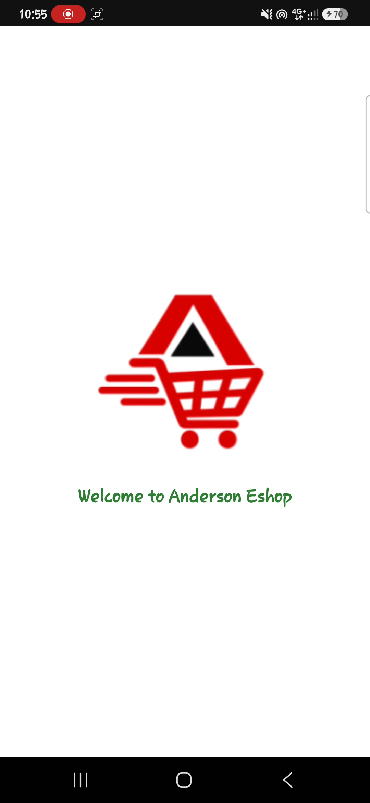
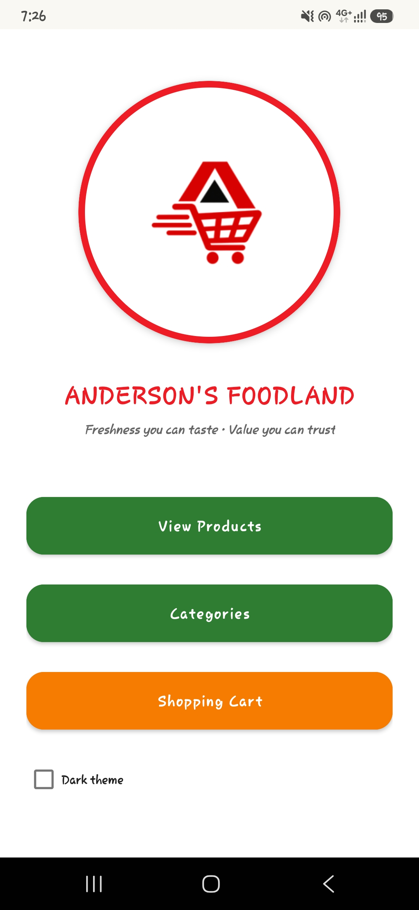
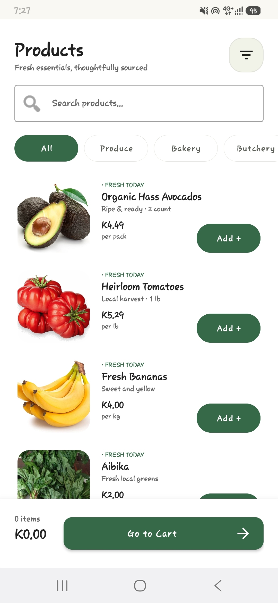
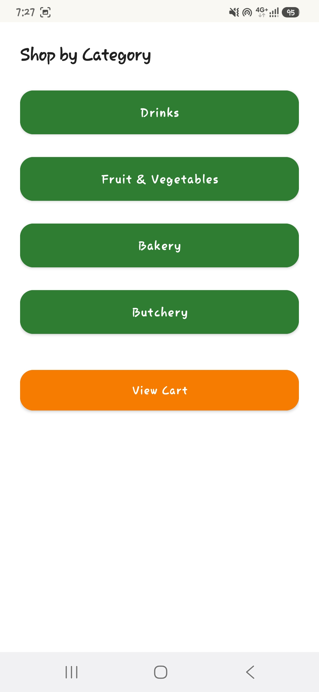
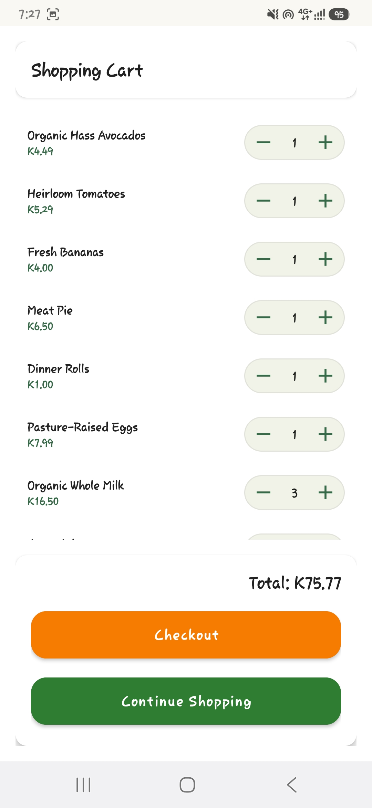
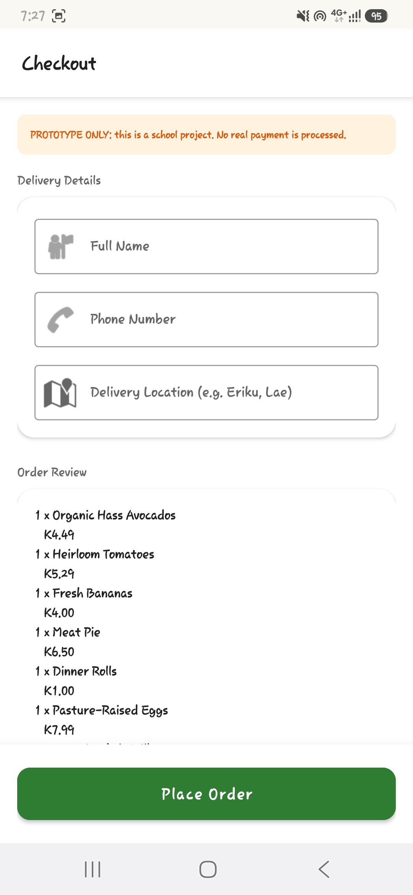
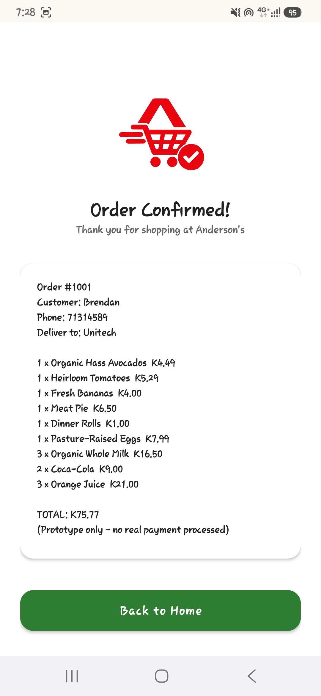

# Anderson Eshop

##  Developed by :
1. Brendan MARAN    ID no.25530136
2. Deborah RAIMBAS  ID no.25530143
3. Valentino TOMON  ID no.25530376

##  Project description

Anderson Eshop is a feature-rich Android mobile application developed in Java that provides a seamless digital shopping experience by allowing users to browse a diverse catalog of bakery, butchery, drinks, and fresh produce. Built on a robust Object-Oriented architecture, the application utilizes inheritance and polymorphism to manage specialized product logic, such as automated bulk discounts, while ensuring a scalable and maintainable codebase. The app features dynamic category filtering, a persistent shopping cart, and a structured checkout flow, all wrapped in a user-friendly interface that includes a professional splash screen and a personalized Dark Mode preference saved via SharedPreferences. By leveraging AndroidX libraries and Material Design principles, Anderson Eshop delivers high performance and visual consistency across a wide variety of devices, making retail and grocery shopping efficient and intuitive.

##  Application Objectives
**1. Primary Goal**
- To develop a robust and user-friendly mobile e-commerce platform that allows customers to browse, manage, and purchase grocery and retail products (Bakery, Butchery, Drinks, etc.) from Anderson Eshop.

**2. Functional Objectives**
- Product Catalog Management: To provide an organized display of products categorized by type (e.g., Fruits, Vegetables, Bakery) using a centralized ProductCatalogue.
- Efficient Categorization: To enable users to filter products through a dedicated CategoryActivity, making it easier to find specific item groups.
- Shopping Cart System: To implement a persistent shopping cart (Cart and CartItem) that allows users to add, view, and modify items before final purchase.
- Seamless Checkout Process: To facilitate a structured transaction flow from the cart to a CheckoutActivity, culminating in a ConfirmationActivity.
- Data Integrity: To manage store data and customer information effectively using Object-Oriented principles (utilizing ShopData and Customer classes).

**3. User Experience (UX) Objectives**
- Branding & Engagement: To provide a professional first impression through a SplashActivity featuring the company logo and a welcome message.
- Personalization: To offer user-centric features such as a Dark Mode toggle in the MainActivity, allowing users to customize the interface based on their preference or environment.
-  Intuitive Navigation: To ensure a flat and simple navigation structure, allowing users to jump between the home screen, product lists, and their cart with minimal clicks.

 **4. Technical Objectives**
- Cross-Version Compatibility: To utilize AppCompatActivity and the AndroidX libraries to ensure the application remains functional and visually consistent across a wide range of Android OS versions.
- Maintainable Architecture: To apply Object-Oriented Programming (OOP) standards (Inheritance, Encapsulation) through classes like Product and its specialized subclasses (Drink, Bakery, etc.) for easier code scaling and updates.

##  Development tools and Tech Stack
 - Android Studio (IDE)
- Java Development Kit (JDK) 8
- Android SDK (API 34)
- Gradle Build System
- AndroidX Libraries (AppCompat, ConstraintLayout, SplashScreen)
- Google Material Design Components
- Android Emulator / Physical Android Device
- Logcat (Debugging Tool)
- Asset Studio (Image & Vector assets)
- JUnit & Espresso (Testing Frameworks)
  
- **Platform:** Android
- **Language:** Java
- **UI Framework:** Material Design 3
- **Build System:** Gradle (AndroidX enabled)
- **Architecture:** Object-Oriented Programming (OOP) with clean separation of Data, Logic, and UI.

##  Main Features 
Main Features of the Anderson Eshop application:
- Branded Splash Screen: A professional entry point featuring the shop logo and a welcome message to enhance brand identity.
- Dynamic Product Catalog: A comprehensive listing of all available products (Bakery, Butchery, Drinks, etc.) with real-time price and description displays.
- Categorized Browsing: Specialized sections that allow users to filter products by department for a more focused shopping experience.
- Functional Shopping Cart: A system to add, view, and manage items, which persists throughout the user's session.
- Automated Discount Logic: Built-in business rules that automatically apply specialized pricing, such as bulk discounts for specific item categories (e.g., Bakery).
- Personalized UI (Dark Mode): A theme toggle that allows users to switch between Light and Dark modes, with preferences saved across app restarts.
- Structured Checkout Flow: A complete path from cart management to order finalization and purchase confirmation.
- Persistent Settings: Uses SharedPreferences to remember user preferences and configuration.

## OOP concepts demonstrated
The Anderson Eshop application effectively demonstrates core Object-Oriented Programming (OOP) principles through its robust product management system.    Inheritance is central to the design, where a general Product base class is extended by specialized subclasses like Bakery, Butchery, and Drink, allowing for significant code reuse and a logical data hierarchy. Polymorphism is showcased as these subclasses override methods such as calculateSubtotal() and displayProduct() to implement unique business logic—such as applying specific bulk discounts for bakery items—while still allowing the Cart to process them as uniform Product objects. Furthermore, encapsulation is maintained by using protected and private fields with public getter methods to manage data access, while abstraction is achieved by using the Product class as a template to define a common interface for all inventory items, regardless of their specific type.

##  Project Structure

- `ProductActivity`: Handles the main product display, search, and filtering logic.
- `CartActivity`: Manages the user's selected items and total price.
- `CheckoutActivity`: Captures delivery information and finalizes the order.
- `ProductCatalogue`: The master data source for all store items.
- `ShopData`: Manages global application state (like the active cart).

##  Installation instructions 
To install and run the Anderson Eshop application on your development machine, follow these steps:
**1. Prerequisites**
- Android Studio: Ensure you have the latest version of Android Studio (Hedgehog or newer recommended).
- Java Development Kit (JDK): The project uses Java 8. Android Studio comes bundled with the necessary JDK.
- Android SDK: You will need Android SDK Platform 34 (API Level 34) installed via the SDK Manager in Android Studio.

**2. Project Setup**
- Open the Project: Launch Android Studio and select File > Open. Navigate to the AndersonEshop root directory on your computer and click OK.
- Gradle Sync: Once the project opens, Android Studio will automatically start syncing Gradle files. Wait for this process to finish (check the progress bar at the bottom). Ensure you are connected to the internet to download the required dependencies (AppCompat, Material Design, etc.).

 **3. Building the App**
- Clean Project: Go to Build > Clean Project.
- Rebuild Project: Go to Build > Rebuild Project. This ensures all generated files and OOP class hierarchies are correctly compiled.
  
**4. Running the Application**
1.Prepare a Device:
- Physical Device: Connect an Android phone via USB with USB Debugging enabled in Developer Options. (Minimum OS: Android 7.0 / API 24).
- Emulator: Open the Device Manager in Android Studio and start a Virtual Device (AVD).
- Launch: Click the green Run icon (triangle) in the top toolbar or press Shift + F10.
- Deployment: The app will install and automatically launch the SplashActivity followed by the MainActivity.

**Troubleshooting**
- SDK Missing: If prompted that SDK 34 is missing, click the link in the error message to download it automatically.
- Gradle Errors: If sync fails, go to File > Invalidate Caches... and restart Android Studio.

## Screenshots
             

##  AI Assistance Declaration

AI tools were used to assist with the development of this project, including providing guidance, explanations, troubleshooting assistance, and suggestions for improving the application's structure and user interface. The project implementation, testing, and final decisions were reviewed and completed by the project members.

##  Prototype Note
This application is a prototype developed for an OOP Programming assignment. No real payments are processed, and it is intended for educational purposes.

---

